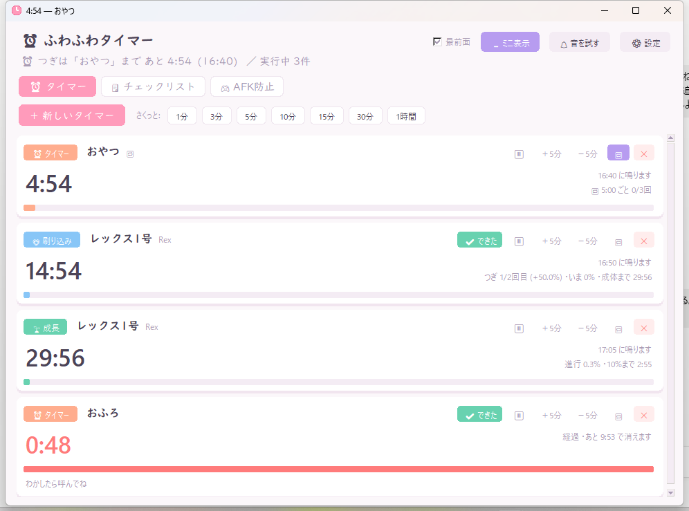
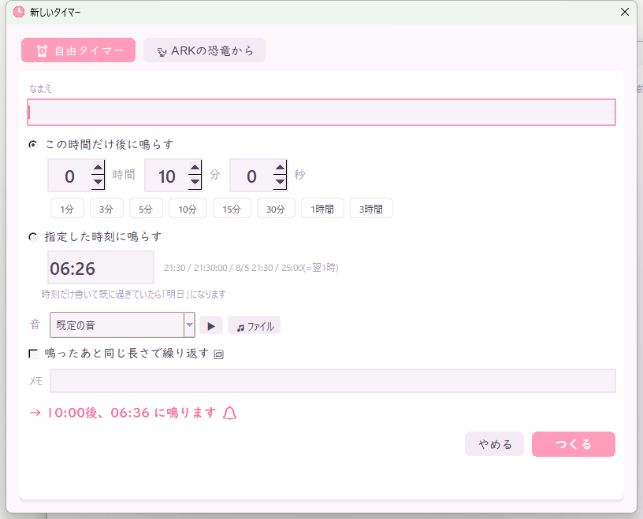
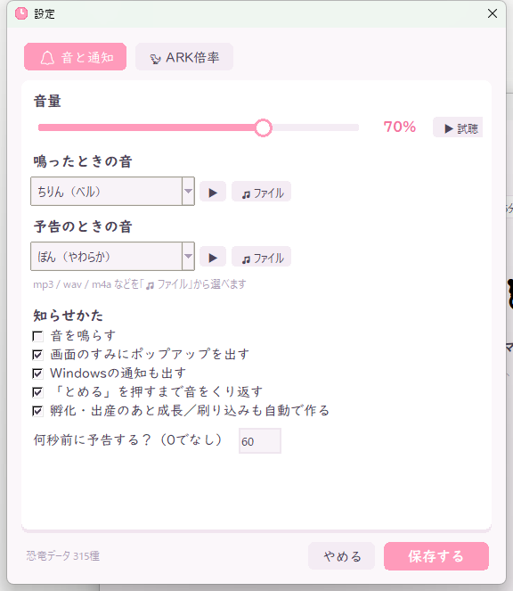
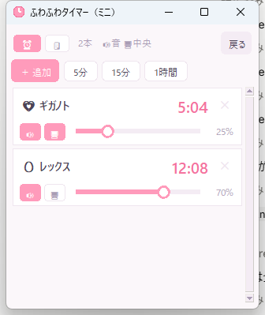
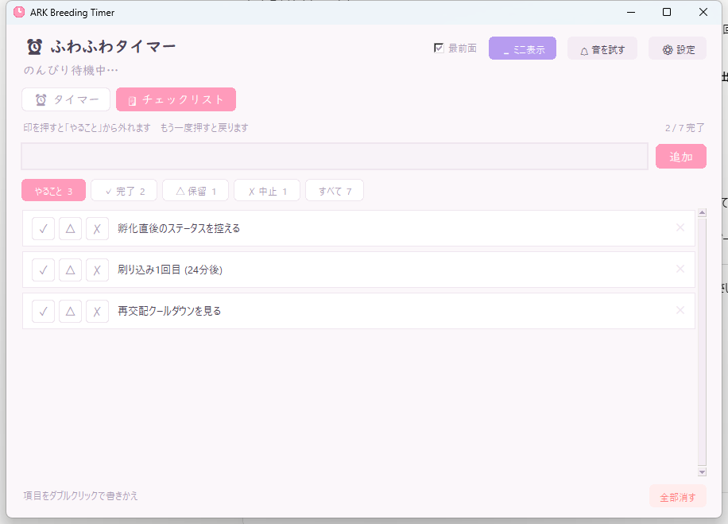

<div align="center">

# ⏰ ふわふわタイマー / ARK Breeding Timer

**かわいい見た目の Windows デスクトップタイマー。**
ふつうのタイマーとしても、ARK: Survival Ascended のブリーディング用としても使えます。
ゲームの横に置いておける**ミニ表示**と、やることを書き留めておける**チェックリスト**つき。

Python 標準ライブラリだけで動きます（追加パッケージなし）。



</div>

---

## できること

### ⏰ 自由タイマー
- **◯時間◯分◯秒後**（1分 / 3分 / 5分 / 10分 / 15分 / 30分 / 1時間 / 3時間 のワンタッチつき）
- **指定した時刻に**（`21:30` / `21:30:00` / `8/5 21:30` / `25:00`＝翌1時）
  時刻だけ書いて既に過ぎていたら自動で「明日」になります
- 🔁 **くり返し** — **ずっと / ◯回まで** を選べて、**2回目からの間隔**も別に決められます
  （例: 最初は5分後、そのあとは15分ごとに3回）。作ったあとでもカードの **🔁** から変えられます
- タイマーごとに**鳴らす音を変えられます**
- メインの画面からワンクリックで作れる「さくっと」ボタン（**名前も長さも自由に変えられます**）

### 🦖 ARK ブリーディング
恐竜を選ぶだけで、サーバー倍率から実時間を計算してタイマーを作ります。

| 種類 | 内容 |
|---|---|
| 🥚 孵化 | 卵が孵るまで。終わると成長・刷り込みタイマーを**自動で作成** |
| 🌸 妊娠 | 胎生（パイロメイン・オヴィスなど）の出産まで |
| 🌱 成長 | 成体まで。**10%（放置できるようになる時点）** でも通知 |
| 💗 刷り込み | 間隔ごとに繰り返し通知。「✔ できた」で次の回へ。何回目 / 1回あたり何% / 累計% を表示 |
| 💞 再交配CD | 次に交配できるまで（最短〜最長） |

恐竜データは **315種**（ARK: Survival Ascended の公式値）。「レックス」「ギガ」のように日本語でも、`rex` `wyv` のように英語でも探せます。
途中の個体は「残り時間から」でゲーム内の残り時間を入れて登録できます。



### 🔔 音・通知
- **内蔵音7種**（ちりん / ぽろん / きらきら / ぴこぴこ / ぽん / アラーム / ピピピ）
  ― 音源ファイルは同梱せず、起動時に**自前で合成**しています
- **自分の mp3 / wav / m4a** も選べます
- **音量スライダー**（内蔵音は波形に音量を焼き込み、mp3等は MCI 経由で音量指定）
- 画面のすみにポップアップ（**ゲームからフォーカスは奪いません**）
- ポップアップは**放っておくと自分で消えます**。残り時間が細いバーで出ます
  （既定: 予告は8秒で消える／鳴ったときは「とめる」を押すまで残る。どちらも秒数で変えられます）
- Windows のトースト通知 / タスクバー点滅
- **◯秒前の予告通知**（既定 60秒、変更・オフ可）
- 「とめる」を押すまで音をくり返す



### ⏰ タイマーの設定
`⚙ 設定 → ⏰ タイマー` で、使い勝手まわりを変えられます。

- **さくっとボタン**の中身（名前と長さ）。追加・削除・「はじめの並びに戻す」つき。
  ここで決めたものがメイン画面とミニ表示の両方に出ます（ミニ表示は先頭4つ）
- **✕ を押したときに確認するかどうか**。オフにすると押した瞬間に消えます


### 🗕 ミニ表示
ゲームの横に置いておく用の小さい窓です。ヘッダーの「🗕 ミニ表示」で開くと、
本体はしまわれてこれだけが残ります。**これだけで一通りの操作ができます。**

- **⏰ / 🗒 のタブ**で、タイマーとチェックリストを切り替えられます
- タイマーは**残り時間の短い順**に並び、終わったものは下に落ちます
- **「＋ 追加」で新しいタイマー**（本体と同じ画面が開きます）。5分 / 15分 / 1時間のワンタッチつき
- 各行の **×** で削除（確認が出ます）
- チェックリストは**本体と同じ中身**です。どちらで変えても両方に反映されます

タイマー1本ごとに、その場でこの3つを変えられます。

| | 内容 |
|---|---|
| **🔊** | このタイマーの音を鳴らすか |
| **🖥** | 終わったときメインモニターの**まんなかに大きく**出すか（ふだんは右上に小さく） |
| **🔁** | くり返しの設定（入切・回数・間隔） |
| スライダー | **このタイマーだけの音量**（未設定なら全体設定に従います） |



窓の大きさ・位置・最後に開いていたタブは次回も覚えています。「戻る」で本体に戻ります。

### 🗒 チェックリスト
上の「🗒 チェックリスト」タブに切り替えると使えます。ステータスの測定手順や
やることのメモなど、タイマーと並べて置いておきたいものを書いておけます。

- **✓ 完了 / △ 保留 / ✗ 中止** の3状態
- **印を押すと「やること」から外れて**、それぞれのタブに移ります。
  もう一度同じ印を押せば戻ります。全部まとめて見たいときは「すべて」
- 絞り込みタブにはそれぞれ**件数**が出ます
- 項目を**ダブルクリックで書きかえ**、行の右端の × で削除
- 書いた内容は自動で保存され、閉じても消えません



### そのほか
- ⏰ タイマー と 🗒 チェックリスト のタブ切り替え（最後に開いていたほうを覚えます）
- ウィンドウを小さくするとボタン類が折り返され、狭いときはヘッダーが2段になります
- 一時停止、±5分の微調整、常に最前面
- タイトルバーに次のタイマーの残り時間（タスクバーで確認できます）
- **アプリを閉じても残り時間は消えません**（絶対時刻で保存）。起動前に終わっていたタイマーもまとめて知らせます

---

## つかいかた

### exe（Python不要）
[Releases](../../releases) から好きなほうをどうぞ。

| | 中身 | むいている人 |
|---|---|---|
| `ArkBreedingTimer.exe` | 1ファイル | とりあえず動かしたい |
| `ArkBreedingTimer-x.y.z-win64.zip` | フォルダ一式 | **ウイルス対策ソフトに消される場合はこちら**。起動も速い |

zip は展開して中の `ArkBreedingTimer.exe` を実行してください。フォルダごと好きな場所に置けます。

### ⚠ ウイルス対策ソフトに引っかかったときは

Windows Defender が `Trojan:Win32/Wacatac.*!ml` などと言ってくることがあります。
これは**誤検知**です。末尾の `!ml` は「機械学習がなんとなく怪しいと判断した」という意味で、
特定のウイルスが見つかったわけではありません。

原因は中身ではなく作り方のほうで、

- PyInstaller の1ファイル形式は、起動時に自分を `%TEMP%` に展開して実行する
  → マルウェアの自己展開と見分けがつかない
- 有料の署名（コードサイニング証明書）を付けていない
- ダウンロード数が少なく「実績」が無い

の3つが重なると引っかかります。Python製のフリーソフトでは定番の症状です。

こちら側の対策として、ビルドでは次をやっています（`tools/build.py`）。

- **UPX圧縮を使わない**（圧縮exeは問答無用で疑われます）
- **バージョン情報を埋め込む**（作者・製品名・著作権が空だと疑われます）
- **フォルダ形式(zip)も配布する**（自己展開しないので、かなり通りやすくなります）

それでも消される場合は:

1. **zip版を使う** — いちばん手軽です
2. **除外に追加する** — Windowsセキュリティ →「ウイルスと脅威の防止」→「設定の管理」
   →「除外」→ 置いたフォルダを追加
3. **誤検知として報告する** — [Microsoft Security Intelligence](https://www.microsoft.com/en-us/wdsi/filesubmission)
   に exe を出して「Incorrectly detected as malware」を選ぶと、たいてい数日で直り、
   ほかの人のところでも出なくなります

自分でソースからビルドすることもできます（下の「ファイル構成」参照）。

### ソースから
Python 3.10 以降（tkinter 同梱の通常のインストールでOK）。

```bat
python ark_breeding_timer.py
```

Windows なら同梱の `起動.bat` でコンソールなしで起動できます。

---

## ARK のサーバー倍率

`⚙ 設定 → 🦖 ARK倍率` に、サーバーの値を入れてください。

| 項目 | 既定値 |
|---|---|
| EggHatchSpeedMultiplier | 15 |
| BabyMatureSpeedMultiplier | 185 |
| BabyCuddleIntervalMultiplier | 0.03125 |
| MatingIntervalMultiplier | 0.001 |
| BabyImprintAmountMultiplier | 1 |

計算式:

```
孵化      = incubationTime / EggHatchSpeedMultiplier
妊娠      = gestationTime  / EggHatchSpeedMultiplier   （設定でオフにできます）
成長      = maturationTime / BabyMatureSpeedMultiplier
刷り込み間隔 = 8時間 × BabyCuddleIntervalMultiplier
刷り込み回数 = 成長時間 ÷ 刷り込み間隔（切り捨て、最低1回）
1回の刷り込み% = 刷り込み間隔 ÷ 成長時間 × 100 × BabyImprintAmountMultiplier
再交配CD  = matingCooldownMin〜Max × MatingIntervalMultiplier
```

上の既定値での例:

| 恐竜 | 孵化 / 妊娠 | 成長 | 刷り込み |
|---|---|---|---|
| Rex | 20:00 | 30:02 | 15分 × 2回（+50%） |
| Giganotosaurus | 3:19:59 | 1:19:08 | 15分 × 5回（+19%、ぜんぶで95%） |
| Pyromane | 妊娠 9:35 | 15:48 | 15分 × 1回 |
| Dodo | 3:20 | 5:00 | 15分 × 1回 |

> **妊娠時間について**: 妊娠に `EggHatchSpeedMultiplier` を掛けるかどうかは設定で切り替えられます。
> 実測とズレる場合はチェックを外すか、「残り時間から」でゲーム内の表示を入れて作ってください。

---

## ファイル構成

```
ark_breeding_timer.py    アプリ本体（ロジックと画面）
theme.py                 かわいい系UIキット（角丸カード・ボタン・スライダー）
sounds.py                音の合成と再生
data/species.json        恐竜の交配データ 315種
tools/build.py           exeのビルド（誤検知対策こみ）
tools/build_species_db.py  恐竜データの生成
tools/make_ico.py        アイコン(.ico)の生成
```

exe を自分でビルドするには（PyInstaller が要ります）:

```bat
pip install pyinstaller
python tools\build.py
```

`dist\` に1ファイル版とフォルダ版(zip)の両方ができて、最後に Defender で
スキャンした結果が出ます。`onefile` / `onedir` を引数に付けると片方だけ作れます。

設定・実行中タイマー・チェックリストの保存先: `%APPDATA%\ArkBreedingTimer\`
（`config.json` / `timers.json` / `checklist.json`）

恐竜データを最新にするには、[ARKStatsExtractor](https://github.com/cadon/ARKStatsExtractor) の
`values.json` と `ASA-values.json` を用意してから:

```bat
python tools\build_species_db.py <values.jsonのパス> <ASA-values.jsonのパス>
```

---

## クレジット

- 恐竜の交配データは [ARKStatsExtractor](https://github.com/cadon/ARKStatsExtractor)（MIT License, © 2015 cadon）の
  `values.json` / `ASA-values.json` から生成しています。
- ARK: Survival Ascended は Studio Wildcard の作品です。本ソフトは非公式のファンツールです。

## ライセンス

MIT License — [LICENSE](LICENSE)
